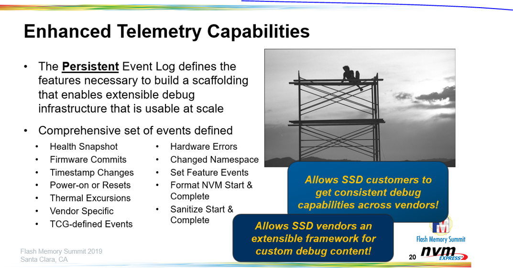
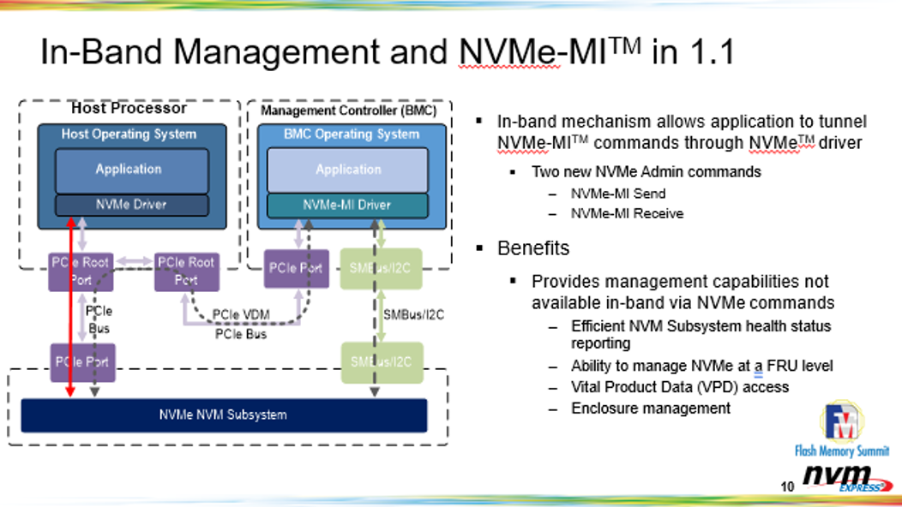
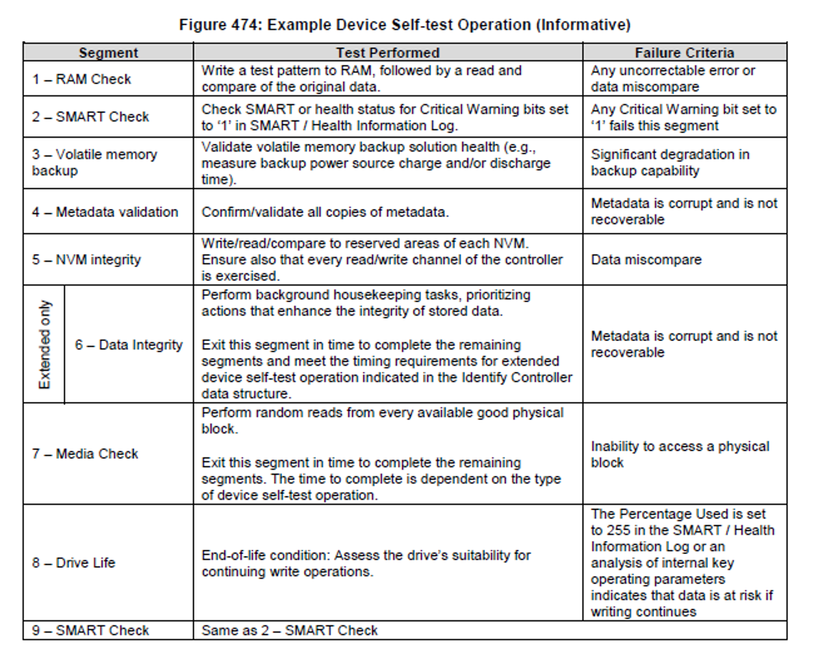

# SSD 是如何发生故障的——NVMe™ SSD 管理、错误报告和日志记录功能

## 简介

NVMe™ 技术是从头开始为 SSD 构建的，最初的 NVMe 规范包括一个标准的 SMART（自我监控、分析和报告技术）日志，用于监控错误、设备运行状况和耐用性。当时，SAS/SATA 驱动器具有 SMART 功能，但它是特定于供应商的（工具必须由供应商解析数据）并且数据并未得到广泛信任。我不能低估这在 NVMe 架构中的重要性——创建一个行业标准的 SMART 日志页面，其中包含监控 SSD 所需的最常见信息。最终，它是一种帮助供应商保持对准确和正确数据报告负责的工具。

从那以后，NVMe 技术中内置了许多功能，包括增强错误报告、日志记录、管理、调试和遥测。这些功能可以内置到从开源管理工具到 OEM 管理控制台的各种工具中，以帮助支持监控 SSD 的状态和运行状况（例如在发生 SSD 故障时通知用户）。更重要的是，客户希望确保他们的 SSD 顺利和正常运行，并能够了解故障的位置和原因以及故障发生的时间。

管理工具、日志页面、耐久性监控等可以帮助识别和查明设备何时发生故障、错误数量和错误类型。这些错误可能包括硬件故障、完整性错误、介质错误、温度问题等。在深入了解 NVMe 技术的功能之前，重要的是要了解 SSD 是如何发生故障的，然后我们可以使用这些工具来帮助预测和预防它们。 SSD故障通常属于这些类别

- 系统不兼容 – 在这种情况下，SSD 没有问题，但兼容性错误阻碍了正常运行。一个示例是系统挂起或未枚举 SSD。如果发生这种情况，客户通常会将 SSD 退回给制造商。

- SSD 耐用性 – SSD 耐用性是有限的，写入数据最终会磨损 SSD。好消息是，这可以通过了解工作负载和 SSD 来准确预测和建模，并且 NVMe 技术可以报告统计数据以实时监控这一点。

- 固件错误 – SSD 固件很复杂，必须处理许多工作负载和状态的极端情况才能传输数据。 SSD 供应商试图在投入生产之前尽可能多地消除固件问题，但完美的验证和验证无法捕捉到所有固件问题。固件故障占 SSD 故障的大部分！

- 介质错误 – 有许多不同类别的 SSD，其中一些具有端到端数据保护、断电保护以及通过 RAID、XOR 或其他技术在 SSD 介质中实现冗余。但NAND闪存等存储和内存类没有故障切换，大多会导致SSD停止运行

- 硬件错误——电容器,寄存器和电源管理电路可能出现故障。这些比较少见，但当它们发生时更具灾难性。

  

## 日志页面

日志页面保存在 SSD 中，可以随时被主机软件读取。以下是 NVMe 技术使用的各种日志页面：

- 错误日志页面
  错误日志页面用于记录所有错误，这样所有错误都会上报。 NVMe 驱动器维护一个错误日志页面，记录所有发生的错误。此日志页面维护有关错误数量、错误来自哪个队列以及哪些数据和命名空间受到影响的重要信息。这对于识别有问题的驱动器和导致系统中可能导致错误的根源至关重要。

- SMART 日志页面
  SMART 日志页面用于报告有关驱动器的一般健康信息。它的主要健康指标称为严重警告，用于警告驱动器出现问题。然后，NVMe 驱动器将通知主机有关问题的类型。问题可能意味着驱动器由于介质错误而处于降级或只读模式，驱动器当前超过温度阈值或可能存在硬件介质故障。 SMART 日志页面还用于总结介质或数据完整性错误的错误日志页面，并列出因断电事件导致的不安全关机次数。最后，SMART 页面对于监测耐力非常有用。通过检查 SMART Percentage Used 字段，系统集成商可以将 SSD 剩余寿命视为已用/可用总寿命的易于读取的百分比。为了最好地利用此功能，供应商可以设置可用备件字段，以便在备件低于某个阈值时向主机发送通知。

- 持久事件日志
  在 [NVMe 1.4 规范变更](https://nvmexpress.org/changes-in-nvme-revision-1-4/)中添加的持久事件日志可以比作 SSD 的黑盒记录器。这可以记录 SSD 上发生的事件，例如错误、更新固件、格式化等，以便人类可以阅读并带有时间戳。这对于希望识别和管理他们的设备和精确定位的 OEM 或操作系统供应商非常有用
- 

- 遥测——为 NVMe 技术添加调试功能
  遥测使 SSD 供应商/制造商能够在设备故障时收集内部日志。 由于客户对 IP 和内部数据收集的敏感性，此处鼓励使用标准的人类可读日志。 该命令可以由主机或控制器启动，但通常对于主机（在这种情况下为客户）在设备发生故障时读出遥测日志并将其发送给他们购买它的 SSD 供应商或 OEM 以进行进一步分析是有意义的 . 正如我们从介绍中看到的，固件问题是 SSD 故障的主要原因，而遥测日志可以让供应商在现场发生故障时找到根本原因。

## 事件和错误报告

与日志页面一起，许多 NVMe 规范功能用于报告错误和操作失败。这些报告有助于识别每种特定类型的错误以及如何恢复控制器、驱动器和操作系统。

- 异步事件请求
  异步事件用于通知主机软件各种事件的状态、错误和健康信息。 NVMe 控制器或驱动器在发生错误、驱动器更改属性、SMART 更改或管理事件完成时向主机软件报告事件。这里最重要的功能是 NVMe 控制器（大多数情况下是驱动器）可以在发生严重警告时异步通知主机，并且操作系统或系统控制台可以立即向用户报告。要了解有关定义的事件类型的更多详细信息，请访问 NVMe 1.4 规范的第 96 页。

- 操作失败
  NVMe 规范包括专门用于控制器/驱动器、驱动程序和操作系统使用的错误报告和恢复的部分。这主要用于设备驱动程序和主机软件系统，以识别 NVM 子系统和 NVMe 控制器的严重故障。此部分可在 NVMe 1.4 规范的第 400 页找到。

- 重建辅助
  在 NVMe 1.4 规范中添加了重建辅助作为选项。 重建辅助定义了一个新的获取逻辑块地址状态功能，可以识别主机可能无法恢复的逻辑块地址。此状态用于确定设备上的哪些逻辑块地址需要由主机从另一个位置恢复并重写。重建辅助的主要用例之一可以帮助替换 SSD 的后台数据清理，因为 SSD 固件通常已经在内部进行此分析，并且现在可以将其报告给主机。主机通常具有数据的冗余副本，现在有机会从有效副本中恢复数据。 

## 管理

NVMe Management Interface™ (NVMe-MI™) 技术的管理能力对于企业、云和数据中心部署至关重要。这些对于支持多种操作系统并受益于一个管理控制台的 OEM 尤其有用，这对最终客户来说是一种增值。

- NVMe-MI 规范
  NVMe-MI 规范通过 SMBUS/MCTP 和 PCIe/VDMs 接口在操作系统之外管理 NVMe SSD。 NVMe-MI 架构使用基板管理控制器来检查目录、监控错误、跟踪 SMART 日志和耐久性，并通过管理控制台报告这些情况。要了解有关 NVMe-MI 规范的更多信息，我们邀请您阅读我们的 [NVMe-MI 技术博客](https://nvmexpress.org/nvme-mi-1-1-why-manageability-is-critical-for-todays-enterprise-storage-demands/)，以更深入地了解其特性和优势。 NVMe-MI 通过提供专门用于管理存储设备的完整规范，真正将 NVMe 标准与其他存储接口区分开来。

## 测试

测试功能有助于进行诊断并确保 NVMe 技术已正确实施。

设备自检命令
NVMe 1.4 规范第 107 页定义的设备自检命令功能允许主机启动短自检或长时间自检以运行离线诊断。 OEM、ODMS 和系统集成商在将新的 NVMe SSD 集成到更大的系统时经常使用此命令功能。 一个例子是在系统集成商或工厂，他们从 SSD 供应商处获取 SSD 并将其放入更大的服务器中，然后继续运行自检命令以确保驱动器全部正常运行。 NVMe 规范包括一个包含示例设备自检的信息图，如下图所示。

## 你如何参与？

正如我们所见，NVMe 技术具有一套强大的特性和功能，可帮助大规模监控、管理和部署 NVMe SSD。 作为一个开放的标准组织，NVM Express 不断改进并从 SSD 供应商、OEM、ODM 和超大规模云服务提供商那里获得关于实际部署中重要事项的真实反馈。 为了跟上这种反馈和不断发展的存储环境，NVM Express 通过添加所需的功能来更新其规范，例如持久事件日志、NVMe 管理界面等。 今年，我们期待继续增强 NVM Express 技术，让最终用户体验既简单又无缝。

我们鼓励有兴趣为 NVM Express 规范贡献其专业知识的成员加入我们的 [NVM Express 工作组](https://workspace.nvmexpress.org//login?back=https%3a%2f%2fworkspace.nvmexpress.org%2fapps%2forg%2fworkgroup%2fportal%2f)之一。

##  参考

[How SSDs Fail – NVMe™ SSD Management, Error Reporting, and Logging Capabilities](https://nvmexpress.org/how-ssds-fail-nvme-ssd-management-error-reporting-and-logging-capabilities/)

